# MarkDown笔记&学习

> 通常在项目里有一个README.md文件，就是通过markdown编写。

***

* ## 标题

  # 我是一级标题
  ## 我是二级标题
  ### 我是三级标题
  #### 我是四级标题
  ##### 我是五级标题
  ###### 我是六级标题

> **通过#符号来进行决定标题等级**  
> 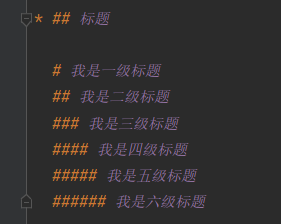

***

* ## 分割线

> 通过***以上来进行分割，其中---和___也可以实现  
> 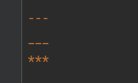

***

* ## 加粗、斜体、删除线

  *我是斜体*

  **我是粗体**

  ~~我是删除体~~

  ***~~当然也可以全都放在一段文字里~~***

> *代表让文字斜体  
> **代表让文字粗体  
> ~~给文字添加删除线  
> 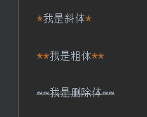

***

* ## 有序列表、无序列表、复选框列表
    * 我是无序列表
    * 我是无序列表
    * 我是无序列表

    1. 我是有序列表
    2. 我是有序列表
    3. 我是有序列表

    * [x] 我是复选框列表
    * [x] 我是复选框列表
    * [ ] 我是复选框列表

> 通过*、-、+号来表示无序列表  
> "数字. "来表示有序列表注意空格  
> 用[ ] 来表示复选框,其中打勾的用[x]表示  
> 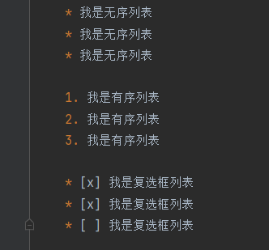

***

* ## 代码块

```java
public class Main {
    public static void main(String[] args) {
        System.out.println("hello world");
    }
}
```

    我是代码块

> 通过三个点符号(和波浪键一个键)来表示代码块,也可以使用四个空格来展示代码  
> 但是用三个点可以展示代码的语言例如" ```java"  
> 也可以通过一个点来给一段文字加上代码`System.out.println();`  
> 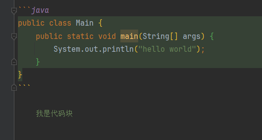

* ## 引用文本

> 我是引用文本

> 用>来表示引用文本  
> 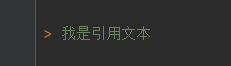

***

* ## 超链接

我的[GitHub](https://github.com/AfeiBaili)

欢迎来到[百度][a]

[a]: https://www.baidu.com

> 超链接有两种写法，一种直接写在文字里通过"[] ()"  
> 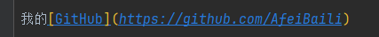  
> 另一种通过声明一个变量的形式"[] []"  
> 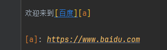

* ## 插入图片

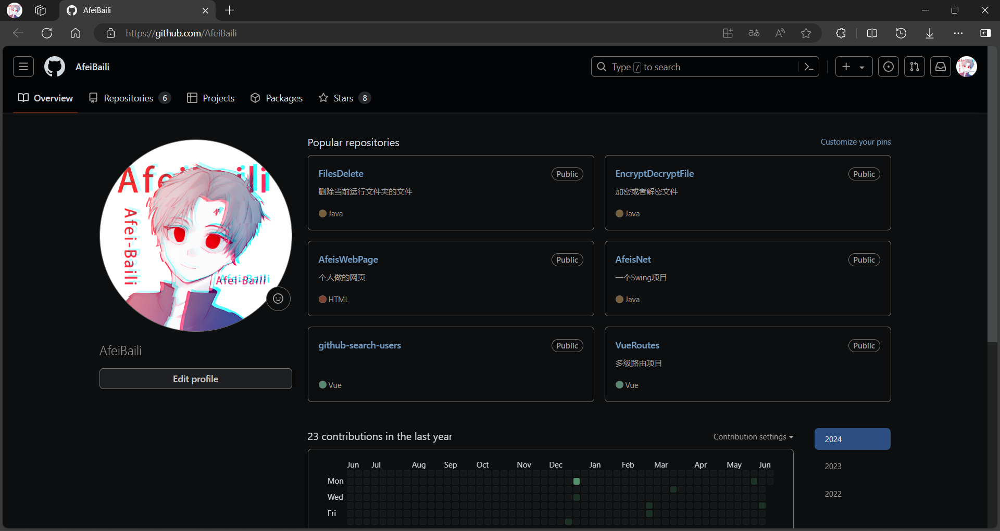


> 插入图片用![] ()来进行插入，可以插入本地也可以插入URL上的  
> 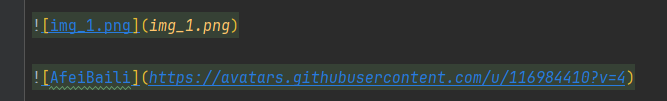

***

* ## 表格插入

|   name    | age |
|:---------:|-----|
| AfeiBaili | 19  |

> 通过|和-来进行制表然后可以用:来控制对齐  
> 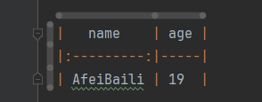  
> 靠左使用|:---|  
> 靠右使用|---:|  
> 居中就是|:--:|

***

* ## HTML插入

<div style="background: linear-gradient(70deg,#dc6767,#b64141);color: black">我是div</div>

> 通过html来插入
> ```html
> <div style="background: linear-gradient(70deg,#dc6767,#b64141);color: black">我是div</div>
> ```